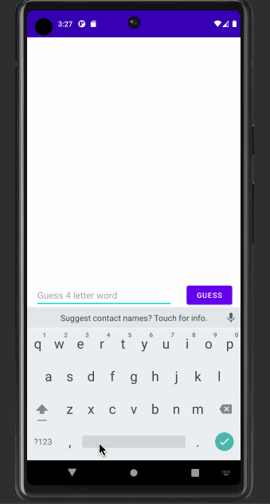

# CSS-388-Wordle

# Android Project 1 - Wordle

Submitted by: Omar Mohamed

Wordle is an android app that recreates a simple version of the popular word game [Wordle](https://www.nytimes.com/games/wordle/index.html).

Time spent: 4 hours spent in total

## Required Features

The following **required** functionality is completed:

- [x] **User has 3 chances to guess a random 4 letter word**
- [x] **After 3 guesses, user should no longer be able to submit another guess**
- [x] **After each guess, user sees the "correctness" of the guess**
- [x] **After all guesses are taken, user can see the target word displayed**

The following **optional** features are implemented:

- [ ] User can toggle betweeen different word lists
- [ ] User can see the 'correctness' of their guess through colors on the word
- [x] User sees a visual change after guessing the correct word
- [ ] User can tap a 'Reset' button to get a new word and clear previous guesses
- [ ] User will get an error message if they input an invalid guess
- [ ] User can see a 'streak' record of how many words they've guessed correctly.

!

## Video Walkthrough

Here's a walkthrough gif:

